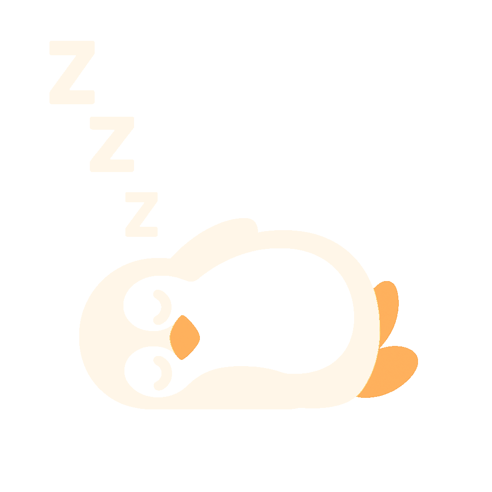

# PenguinTomato 🐧

PenguinTomato is a macOS Pomodoro-style focus timer that pairs structured work/break cycles with an ever-encouraging waddle of penguins. Built with SwiftUI, it lives in your menu bar and keeps sessions lighthearted but productive.
There is not really a reason, I like penguins and needed a pomodoro timer that I can style/edit myself.

<p align="center">
  
</p>

## Features
- Customizable focus and break durations with immediate validation feedback.
- Automatic transitions between focus and break phases so you stay in flow.
- Menu bar timer and status icons that mirror the in-app state.
- Delightful penguin illustrations and celebratory sounds when sessions complete.

## Requirements
- macOS 14 Sonoma or newer.
- Xcode 15 or newer (for building and signing the app bundle).
- Swift 5.9 toolchain (bundled with Xcode 15).

## Building the App
1. Open the project as an SPM-based workspace by running `open Package.swift` in Finder or Xcode.
2. Select the "PenguinTomato" scheme and your preferred "My Mac" destination.
3. Build and run (`Command + R`) to launch the app with live previews of the timers and penguin artwork.
4. Grant notification permission on first launch to receive completion alerts.

## Running Tests
- Execute the unit test suite from the command line with `swift test`.
- Or run the `PenguinTomatoTests` scheme inside Xcode for integrated reporting.

The tests focus on `TimerModel`, ensuring session transitions, clamping logic, and menu bar messaging behave consistently across machines.

## Packaging a DMG
For quick sharing you don’t need to archive from Xcode—run the helper script in `Scripts/build_dmg.sh` instead:

```bash
./Scripts/build_dmg.sh
```

The script will prompt you for:
- a version label (used in the DMG/staging folder names)
- whether to clean previous `.build/` and `dist/` outputs
- whether to ad-hoc sign the bundle (useful so Gatekeeper only shows the standard “unverified developer” prompt)

When it completes you’ll have:
- `.build/PenguinTomato-<version>-staging/PenguinTomato.app`
- `dist/PenguinTomato-<version>.dmg`

Ship the DMG, and remind recipients to Control-click → **Open** the first time. For convenience, reference artwork that we don’t ship lives in `Assets/ReferenceArt/` and the full-resolution icon source in `Assets/IconSource/`.

## Assets
Runtime images are bundled through `Sources/PenguinTomato/Assets.xcassets`, so everything loads via `Bundle.module`. The original PNGs are kept for reference under `Assets/ReferenceArt/`, and the menu bar/App icon source lives in `Assets/IconSource/`. The audio cue remains at `Sources/PenguinTomato/Resources/emperor_penguin_trumpet.mp3`.

<p align="center">
  
  
  
  
</p>
