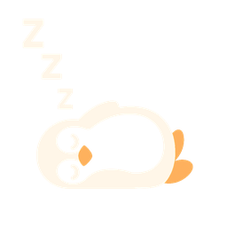

  

    
  

  <h1 style="text-align:center;margin-top:0;">PenguinTomato</h1>
  
PenguinTomato is a macOS Pomodoro-style focus timer that pairs structured work/break cycles with an ever-encouraging waddle of penguins. It is built with SwiftUI and ships as a menu bar companion app, keeping your focus sessions lighthearted but productive.

  

    
  

  <h2>Features</h2>
  <ul style="list-style:none;padding-left:0;">
    <li style="margin-bottom:12px;display:flex;align-items:center;">
      
      Customizable focus and break durations with immediate validation feedback.
    </li>
    <li style="margin-bottom:12px;display:flex;align-items:center;">
      
      Automatic transitions between focus and break phases so you stay in flow.
    </li>
    <li style="margin-bottom:12px;display:flex;align-items:center;">
      
      Menu bar timer and status icons that mirror the in-app state.
    </li>
    <li style="margin-bottom:12px;display:flex;align-items:center;">
      
      Delightful penguin illustrations and celebratory sounds when sessions complete.
    </li>
    <li style="display:flex;align-items:center;">
      
      Local notifications to remind you when it is time to switch gears.
    </li>
  </ul>

  <h2>Requirements</h2>
  <ul>
    <li>macOS 14 Sonoma or newer.</li>
    <li>Xcode 15 or newer (for building and signing the app bundle).</li>
    <li>Swift 5.9 toolchain (bundled with Xcode 15).</li>
  </ul>

  <h2>Building the App</h2>
  <ol>
    <li>Open the project as an SPM-based workspace by running <code>open Package.swift</code> in Finder or Xcode.</li>
    <li>Select the "PenguinTomato" scheme and your preferred "My Mac" destination.</li>
    <li>Build and run (<code>Command + R</code>) to launch the app with live previews of the timers and penguin artwork.</li>
    <li>Grant notification permission on first launch to receive completion alerts.</li>
  </ol>

  <h2>Running Tests</h2>
  <ul>
    <li>Execute the unit test suite from the command line with <code>swift test</code>.</li>
    <li>Or run the <code>PenguinTomatoTests</code> scheme inside Xcode for integrated reporting.</li>
  </ul>
  
The tests focus on <code>TimerModel</code>, ensuring session transitions, clamping logic, and menu bar messaging behave consistently across machines.

  <h2>Assets</h2>
  
The penguin illustrations and sound live under <code>Sources/PenguinTomato/Resources/</code>. They are referenced directly by the Swift Package, so there is no need to copy or relocate them when building or distributing the app.

  <ul>
    <li><code>focussed_penguin.png</code> — focus session badge.</li>
    <li><code>break_penguin.png</code> — break-time mascot.</li>
    <li><code>pause_penguin.png</code> — pause state artwork.</li>
    <li><code>sleeping_penguin.png</code> — idle indicator.</li>
    <li><code>emperor_penguin_trumpet.mp3</code> — celebratory completion jingle.</li>
  </ul>

  <h2>Distributing to Friends</h2>
  <ol>
    <li>Archive the app from Xcode (<code>Product &gt; Archive</code>) using a Developer ID certificate.</li>
    <li>Notarize the resulting build (<code>xcrun notarytool submit --wait</code>).</li>
    <li>Staple the notarization ticket (<code>xcrun stapler staple PenguinTomato.app</code>).</li>
    <li>Share the signed <code>.app</code> or <code>.dmg</code>; recipients on other Macs can open it without Gatekeeper warnings.</li>
  </ol>
  
If you prefer TestFlight-style distribution, create a Swift package release or host the notarized build on a trusted file share.

  <h2>Contributing</h2>
  
Questions, feature ideas, or penguin art contributions are welcome! Fork the repository, create a branch, and submit a pull request with a clear description and screenshots where relevant.

  <h2>License</h2>
  
This project currently has no explicit license. Please treat it as all rights reserved until a license is added.

