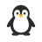
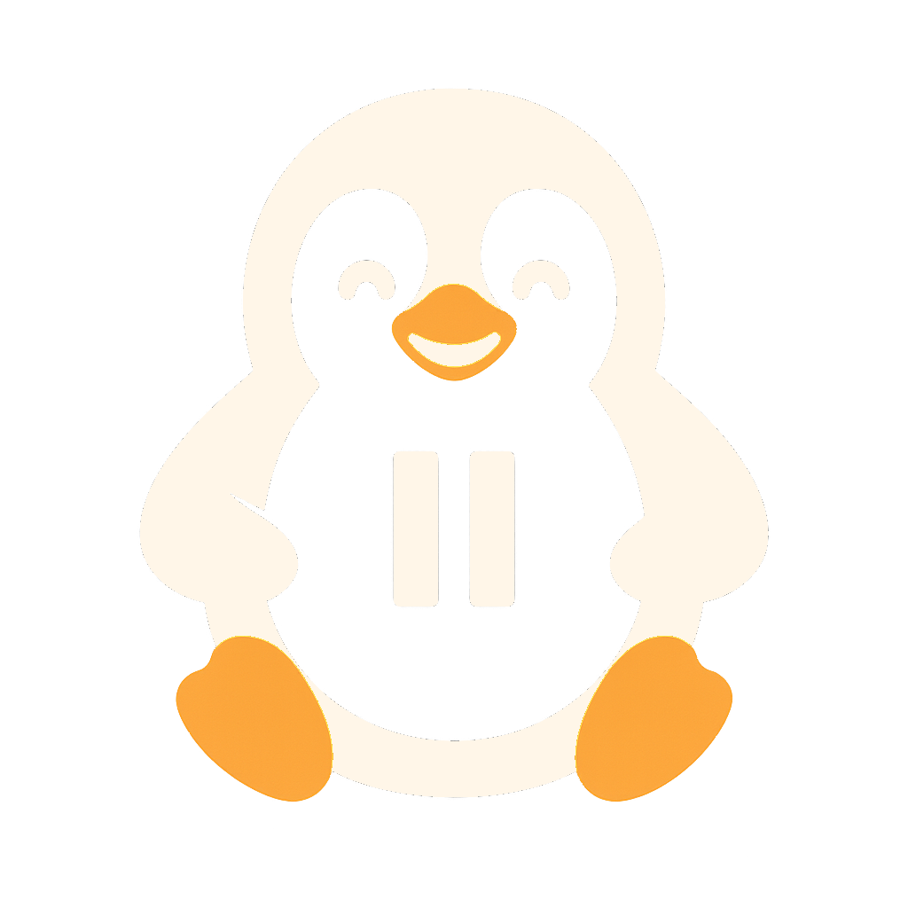

# PenguinTomato 🐧

PenguinTomato is a macOS Pomodoro-style focus timer that pairs structured work/break cycles with an ever-encouraging waddle of penguins. Built with SwiftUI, it lives in your menu bar and keeps sessions lighthearted but productive.

  

## Features
<table>
  <tr>
    <td width="40"></td>
    <td>Customizable focus and break durations with immediate validation feedback.</td>
  </tr>
  <tr>
    <td></td>
    <td>Automatic transitions between focus and break phases so you stay in flow.</td>
  </tr>
  <tr>
    <td></td>
    <td>Menu bar timer and status icons that mirror the in-app state.</td>
  </tr>
  <tr>
    <td></td>
    <td>Delightful penguin illustrations and celebratory sounds when sessions complete.</td>
  </tr>
  <tr>
    <td></td>
    <td>Local notifications to remind you when it is time to switch gears.</td>
  </tr>
</table>

## Requirements
<table>
  <tr>
    <td width="40"></td>
    <td>macOS 14 Sonoma or newer.</td>
  </tr>
  <tr>
    <td></td>
    <td>Xcode 15 or newer (for building and signing the app bundle).</td>
  </tr>
  <tr>
    <td></td>
    <td>Swift 5.9 toolchain (bundled with Xcode 15).</td>
  </tr>
</table>

## Building the App
<table>
  <tr>
    <td width="40"></td>
    <td>Open the project as an SPM-based workspace by running <code>open Package.swift</code> in Finder or Xcode.</td>
  </tr>
  <tr>
    <td></td>
    <td>Select the "PenguinTomato" scheme and your preferred "My Mac" destination.</td>
  </tr>
  <tr>
    <td></td>
    <td>Build and run (<code>Command + R</code>) to launch the app with live previews of the timers and penguin artwork.</td>
  </tr>
  <tr>
    <td></td>
    <td>Grant notification permission on first launch to receive completion alerts.</td>
  </tr>
</table>

## Running Tests
<table>
  <tr>
    <td width="40"></td>
    <td>Execute the unit test suite from the command line with <code>swift test</code>.</td>
  </tr>
  <tr>
    <td></td>
    <td>Or run the <code>PenguinTomatoTests</code> scheme inside Xcode for integrated reporting.</td>
  </tr>
</table>

The tests focus on <code>TimerModel</code>, ensuring session transitions, clamping logic, and menu bar messaging behave consistently across machines.

## Assets
<table>
  <tr>
    <td width="40"></td>
    <td>The penguin illustrations and sound live under <code>Sources/PenguinTomato/Resources/</code>. They are referenced directly by the Swift Package, so there is no need to copy or relocate them when building or distributing the app.</td>
  </tr>
</table>

<table>
  <tr>
    <td width="40"></td>
    <td><code>focussed_penguin.png</code> — focus session badge.</td>
  </tr>
  <tr>
    <td></td>
    <td><code>break_penguin.png</code> — break-time mascot.</td>
  </tr>
  <tr>
    <td></td>
    <td><code>pause_penguin.png</code> — pause state artwork.</td>
  </tr>
  <tr>
    <td></td>
    <td><code>sleeping_penguin.png</code> — idle indicator.</td>
  </tr>
  <tr>
    <td></td>
    <td><code>emperor_penguin_trumpet.mp3</code> — celebratory completion jingle.</td>
  </tr>
</table>

## Distributing to Friends
<table>
  <tr>
    <td width="40"></td>
    <td>Archive the app from Xcode (<code>Product &gt; Archive</code>) using a Developer ID certificate.</td>
  </tr>
  <tr>
    <td></td>
    <td>Notarize the resulting build (<code>xcrun notarytool submit --wait</code>).</td>
  </tr>
  <tr>
    <td></td>
    <td>Staple the notarization ticket (<code>xcrun stapler staple PenguinTomato.app</code>).</td>
  </tr>
  <tr>
    <td></td>
    <td>Share the signed <code>.app</code> or <code>.dmg</code>; recipients on other Macs can open it without Gatekeeper warnings.</td>
  </tr>
</table>

If you prefer TestFlight-style distribution, create a Swift package release or host the notarized build on a trusted file share.

## Contributing
<table>
  <tr>
    <td width="40"></td>
    <td>Questions, feature ideas, or penguin art contributions are welcome! Fork the repository, create a branch, and submit a pull request with a clear description and screenshots where relevant.</td>
  </tr>
</table>

## License
<table>
  <tr>
    <td width="40"></td>
    <td>This project currently has no explicit license. Please treat it as all rights reserved until a license is added.</td>
  </tr>
</table>
